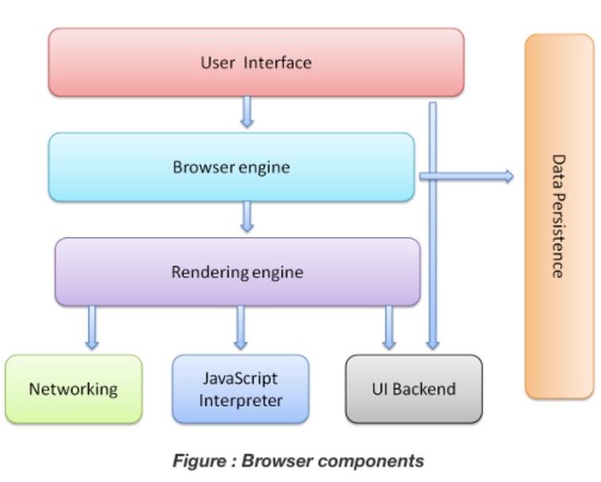

## Browser and its functionalities
A web browser is application software for accessing websites. When a user requests a web page from a particular website, the browser retrieves its files from a web server and then displays the page on the user's screen. Google Chrome, Mozilla Firefox, Opera, Apple Safari, etc are the examples of Browser.

A web browser allows sending and receiving of information from all parts of the web. The HTTP (Hypertext Transfer Protocol) allows data transfer while governing all pieces of content. The user interface is what enables graphical representation of the data and allows users to explore it.

The backend of the browsers are the one handling requests and becomes the carrier for information transfer and interaction. While the clean front end allows users to scroll and browse.

## Components of a Web Browser

### 1. User Interface
It is an environment allowing users to use certain features like search bar, refresh button, menu, bookmarks, etc.

### 2. Browser Engine
The bridge connects the interface and the engine. It monitors the rendition engine while manipulating the inputs coming from multiple user interfaces.

### 3. Rendering Engine
As the name suggests, this component is responsible for rendering a specific web page requested by the user on their screen. It interprets HTML and XML documents along with images that are styled or formatted using CSS, and a final layout is generated, which is displayed on the user interface.

### 4. Networking 
This component is responsible for managing network calls using standard protocols like HTTP or FTP. It also looks after security issues associated with internet communication.

### 5. JavaScript Interpreter
As the name suggests, it is responsible for parsing and executing the JavaScript code embedded in a website. Once the interpreted results are generated, they are forwarded to the rendering engine for displaying on the user interface.

### 6. UI Backend
This component uses the user interface methods of the underlying operating system. It is mainly used for drawing basic widgets (windows and combo boxes).

### 7. Data Storage/Persistence
It is a persistent layer. A web browser needs to store various types of data locally, for example, cookies. As a result, browsers must be compatible with data storage mechanisms such as WebSQL, IndexedDB, FileSystem, etc.

## Role of Rendering Engine
Once a user requests a particular document, the rendering engine starts fetching the content of the requested document. This is done via the networking layer. The rendering engine starts receiving the content of that specific document in chunks of 8 KBs from the networking layer. After this, the basic flow of the rendering engine begins.

The four basic steps include:

The requested HTML page is parsed in chunks, including the external CSS files and in style elements, by the rendering engine. The HTML elements are then converted into DOM nodes to form a “content tree” or “DOM tree.”

Simultaneously, the browser also creates a render tree. This tree includes both the styling information as well as the visual instructions that define the order in which the elements will be displayed. The render tree ensures that the content is displayed in the desired order.

Further, the render tree goes through the layout process. When a render tree is created, the position or size values are not assigned. The entire process of calculating values for evaluating the desired position is called a layout process. In this process, every node is assigned the exact coordinates. This ensures that every node appears at an accurate position on the screen.

The final step is to paint the screen, wherein the render tree is traversed, and the renderer’s paint() method is invoked, which paints each node on the screen using the UI backend layer.

## HTML Parsing
So we have HTML content at the beginning which goes through a process called tokenization, tokenization is a common process in almost every programming language where code is split into several tokens which are easier to understand while parsing. This is where the HTML's parser understands which is the start and which is the end of the tag, which tag it is and what is inside the tag.

Now we know, html tag starts at the top and then the head tag starts before the html ends so we can figure out that the head is inside html and create a tree out of it. Thus we then get something called a parse tree which eventually becomes a DOM tree as shown in the image below:

DOM tree is what we access when we do document.getElementById or document.querySelector in JavaScript.

Just like HTML, CSS goes through a similar process where we have the CSS text and then the tokenization of CSS to eventually create something called a CSSOM or CSS Object Model.

This is what a CSS Object Model looks like:

Awesome! now we have DOM and CSSOM so we got every information that is required to get our screens painted!

## Rendering of Web Page

For rendering, a DOM and CSSOM are merged to form something called a Render Tree. Render Tree has the information required to mark and paint elements on the screen.

So now we have a render tree with all the information that is needed to create a visual page. Now, the renderer will use this information to create a Layout and then a Paint, we will talk about Layout and Paint in next point before that here's what the overall process looks like:

## Layout
The layout is where the elements are marked on the screen. The layout includes all the calculations and mathematics behind an element's position so it takes all the properties related to the position (height, width, position, top left right bottom, etc) from The Render Tree and places the elements on the screen.

## Paint
After Layout, a Paint happens. Paint takes properties like color, background-color, border-color, box-shadow, etc. to paint the screen with colors.

After the paint, we see the content on the screen and the first time we see something other than a white screen is called 'First Paint'. The term First Paint is used in performance reports to show how long your website took to show something on the screen.

## The order of processing scripts and style sheets Scripts 

The model of the web is synchronous. Authors expect scripts to be parsed and executed immediately when the parser reaches a \<script> tag.

The parsing of the document halts until the script has been executed.

If the script is external then the resource must first be fetched from the network - this is also done synchronously, and parsing halts until the resource is fetched.

This was the model for many years and is also specified in HTML4 and 5 specifications.

Authors can add the "defer" attribute to a script, in which case it will not halt document parsing and will execute after the document is parsed. HTML5 adds an option to mark the script as asynchronous so it will be parsed and executed by a different thread.

